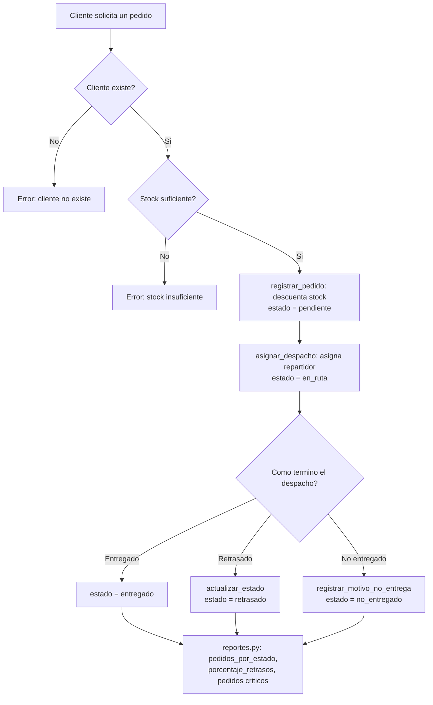

Proyecto final — **Computación Aplicada**
Sistema en **Python** para registrar clientes, controlar stock, generar pedidos, gestionar despacho y calcular reportes de pedidos retrasados o no entregados, desarrollado en equipo con apoyo de **Codex / IA**.


## 🧭 Diagrama de flujo


El flujo resume lo que hace cada módulo en orden: el cliente pide un pedido → se valida que el cliente exista (`clientes.py`) → se valida que haya stock (`stock.py`) → si todo es correcto, se registra el pedido y se descuenta el stock (`pedidos.py`) → se asigna despacho (`despacho.py`) → el pedido termina en uno de tres caminos: entregado, retrasado o no entregado → todos los estados alimentan los indicadores finales (`reportes.py`).

También puedes ver el diagrama editable en Mermaid aquí abajo (GitHub lo renderiza automáticamente):



---

## 🤖 Prompts usados para pedirle código a la IA

Siguiendo el manual del curso, no le pedimos a la IA "todo el proyecto de una vez". Primero pedimos un **plan general**, y luego un **prompt por módulo**, pidiendo funciones pequeñas y explicadas. Estos son los prompts reales que usamos:

### 1) Prompt inicial — plan general (antes de pedir código)
```
Quiero desarrollar en Python un sistema de control de pedidos no entregados.
Necesito que primero propongas un plan del proyecto y no escribas todo el código de una vez.

Condiciones:
1. El sistema tendrá módulos para clientes, pedidos, stock, despacho y reportes.
2. Debe trabajar con funciones claras, con parámetros y retorno.
3. Debe tener menú principal y submenús.
4. Debe validar entradas y evitar errores simples.
5. Quiero una propuesta de estructura de carpetas, nombres de archivos y lista
   de funciones por módulo.
6. Después del plan, quiero implementar módulo por módulo.
```

### 2) Responsable de clientes
```
Ayúdame a construir el módulo clientes.py para un sistema de control de pedidos
no entregados. Necesito funciones pequeñas y reutilizables:
- registrar_cliente(nombre, telefono, direccion)
- buscar_cliente(cliente_id)
- listar_clientes()
No uses librerías innecesarias. Explica cada función, sus parámetros, su retorno
y muestra un ejemplo de uso.
```

### 3) Responsable de pedidos
```
Diseña en Python el módulo pedidos.py para un sistema de control de pedidos no
entregados. Necesito funciones pequeñas y reutilizables. Incluye por ahora:
- registrar_pedido(cliente_id, lista_productos)
- buscar_pedido(codigo)
- listar_pedidos()
- validar_datos_pedido(...)
No uses librerías innecesarias. Explica cada función, sus parámetros, su retorno
y muestra un ejemplo de uso.
```

### 4) Responsable de stock
```
Ayúdame a construir el módulo stock.py.
Necesito funciones propias para:
- verificar_stock(producto_id, cantidad)
- agregar_stock(producto_id, cantidad)
- descontar_stock(producto_id, cantidad)
- mostrar_stock_bajo(minimo)
Incluye validaciones y casos de prueba simples. No generes un sistema completo;
solo este módulo.
```

### 5) Responsable de despacho
```
Construye el módulo despacho.py para asignar repartidor y actualizar el estado
del pedido. Necesito estas funciones:
- asignar_despacho(codigo_pedido, repartidor)
- actualizar_estado(codigo_pedido, nuevo_estado)
- registrar_motivo_no_entrega(codigo_pedido, motivo)
El estado debe controlar: pendiente, en_ruta, entregado, retrasado, no_entregado.
```

### 6) Responsable de reportes
```
Ayúdame a crear el módulo reportes.py.
Necesito funciones que calculen:
- total de pedidos
- total de pedidos entregados
- total de pedidos no entregados
- porcentaje de pedidos retrasados
- listado de pedidos críticos
Además, necesito que expliques cómo se calcula cada indicador.
```

### 7) Integrador — menú principal
```
Ya tengo módulos separados para clientes, pedidos, stock, despacho y reportes.
Ayúdame a construir un menú principal en main.py que conecte estos módulos sin
duplicar lógica. Primero dame el esquema del menú, luego el código, y finalmente
una lista de pruebas de integración.
```

Después de cada respuesta de la IA, **revisamos el código a mano**: probamos casos válidos e inválidos, corregimos nombres, y unificamos la validación de estados en una sola función (`cambiar_estado_pedido`) para que `pedidos.py` y `despacho.py` no tuvieran reglas distintas.

---

## 💻 Código y app funcional

- `proyecto_pedidos/` → todo el código Python (main.py + módulos), el mismo que corre en consola.
- `index.html` → **versión funcional en el navegador** con la misma lógica de negocio (validar stock, registrar pedido, despacho, reportes en vivo). Es la que se ve publicada con GitHub Pages.

### Ejecutar el sistema en Python
```bash
cd proyecto_pedidos
python main.py
```
MIGRACION A HTML 
Prompt #8 — Conversión a versión web 
Ya tengo el sistema completo en Python: módulos clientes.py, productos.py,
stock.py, pedidos.py, despacho.py y reportes.py, cada uno con funciones
pequeñas, validadas, con parámetros y retorno.

Necesito una versión funcional en el navegador (un solo archivo index.html,
con HTML, CSS y JS) que replique exactamente la misma lógica de negocio:
- Las mismas funciones y validaciones de cada módulo, traducidas a JavaScript.
- Los datos (clientes, productos, pedidos) deben vivir en memoria dentro del
  navegador, ya que no hay acceso a archivos como en Python.
- Debe reemplazar el menú de consola por una interfaz visual (sidebar +
  formularios) que llame a esas mismas funciones.
- No debe depender de instalar nada ni de un servidor: debe poder abrirse con
  doble clic o publicarse con GitHub Pages.
No dupliques lógica ni cambies las reglas de validación que ya definimos en
Python; el comportamiento debe ser idéntico, solo cambia el lenguaje y la
interfaz.


